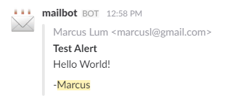

# Serverless-Mailgun-Slack

If you've got a small personal slack setup that you don't want to pay for upgrading to a paid tier, but would like an email integration, this is a quick and _almost_ free way to go (it might cost you a few pennies a month). Implemented as an AWS Lambda NodeJS function and Serverless Web API configuration for posting notifications to Slack when triggered by Mailgun incoming mail routes. 

## Prerequisites

* You should have an AWS Account. Sign up, it's free!
* You should have a Mailgun Account. Also free to sign up.
* Do you have a Slack account? There's a free tier.
* NodeJS and Serverless (`npm install -g serverless`)
* Serverless depends on AWS-CLI, so if you haven't already, install it and do an `aws-cli configure` ([details](https://serverless.com/framework/docs/providers/aws/setup/)).

## Installation

* Get the source: `git clone https://github.com/Marcus-L/serverless-mailgun-slack.git`
* Install dependencies: `cd src` and `npm install`

* ### Enter keys into src/handler.js
```
// configuration
const MAILGUN_KEY = "key-.....";
const SLACKHOOK_URL = "https://hooks.slack.com/services/.....";
```
The Mailgun API Key can be found on your [account settings](https://mailgun.com/app/account/security) page. You can set up a Slack Incoming Webhook from the [apps page](https://slack.com/apps). Don't mind the channel/name/icon, it's overridden in handler.js.

* Deploy: `serverless deploy`
* Make a note of the POST endpoint that was generated (https://....amazonaws.com/dev/post)

### Configure Mailgun routes 
You get a free sandbox domain with Mailgun, but you could also use a custom domain if you set it up. Set up a route as follows:
* Match Recipient (I use a random GUID as the word, but you could use something like "slack", etc): `^[any word]\\+(.*)@[your domain]$`, example: `^38cf11c2084246a49ce0279ff9080f23\+(.*)@sandbox15dc133ed03147c4a8d91029a1e4e0a3.mailgun.org$`
* Store and notify: checked -  `https://.....amazonaws.com/dev/post` (the POST URL of your serverless deploy)
* Stop: checked

## Usage
The handler.js code parses the email address and uses the part after the `+` as the channel to post into. Ex: foo+general@yourdomain.com would post into the #general channel.

The message in slack will include the sender, subject and plaintext of the email. Customize the handler.js as you see fit! Send a test email to your mailgun address and enjoy the instant notification to your slack channel.



## License (MIT)
Copyright (c) 2016 Marcus Lum

Permission is hereby granted, free of charge, to any person obtaining a copy of this software and associated documentation files (the "Software"), to deal in the Software without restriction, including without limitation the rights to use, copy, modify, merge, publish, distribute, sublicense, and/or sell copies of the Software, and to permit persons to whom the Software is furnished to do so, subject to the following conditions:

The above copyright notice and this permission notice shall be included in all copies or substantial portions of the Software.

THE SOFTWARE IS PROVIDED "AS IS", WITHOUT WARRANTY OF ANY KIND, EXPRESS OR IMPLIED, INCLUDING BUT NOT LIMITED TO THE WARRANTIES OF MERCHANTABILITY, FITNESS FOR A PARTICULAR PURPOSE AND NONINFRINGEMENT. IN NO EVENT SHALL THE AUTHORS OR COPYRIGHT HOLDERS BE LIABLE FOR ANY CLAIM, DAMAGES OR OTHER LIABILITY, WHETHER IN AN ACTION OF CONTRACT, TORT OR OTHERWISE, ARISING FROM, OUT OF OR IN CONNECTION WITH THE SOFTWARE OR THE USE OR OTHER DEALINGS IN THE SOFTWARE.